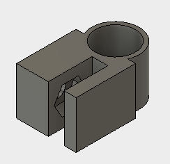

# Parts Repo

A repository of parts that are used between make projects along with any implementation guides.

--------------

## Wire Management

**125-thick-wire-clamp**

A clamp that can connect to surfaces 0.125" thick for organizing cable runs. The wire opening is 10mm thick and the clamo accommodates an M4 screw and nut. X3G files are provided for 1, 5 and 10 copies of the part.

```
LEFT EXTRUDER: 230
RIGHT EXTRUDER: N/A
BUILD PLATFORM: 60
SUPPORTS: Yes
EST TIME: (1) 16min, (5) 48 min, (10) 1hr 37min
```
